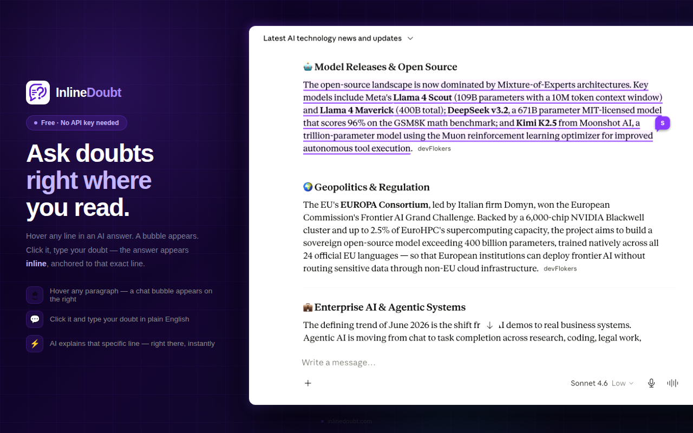
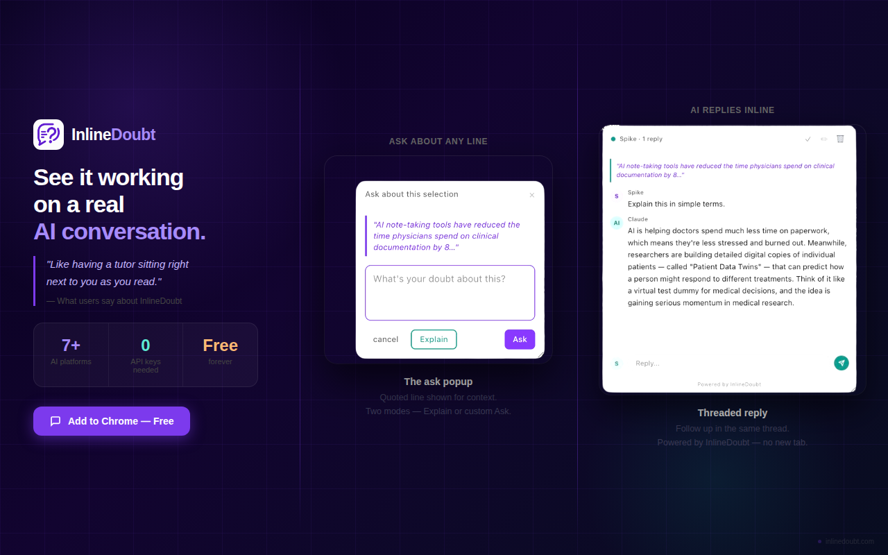
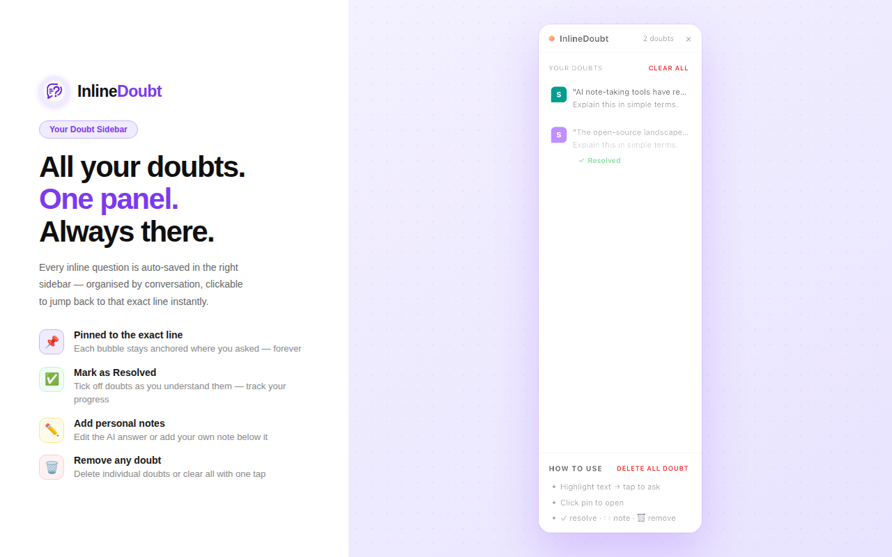
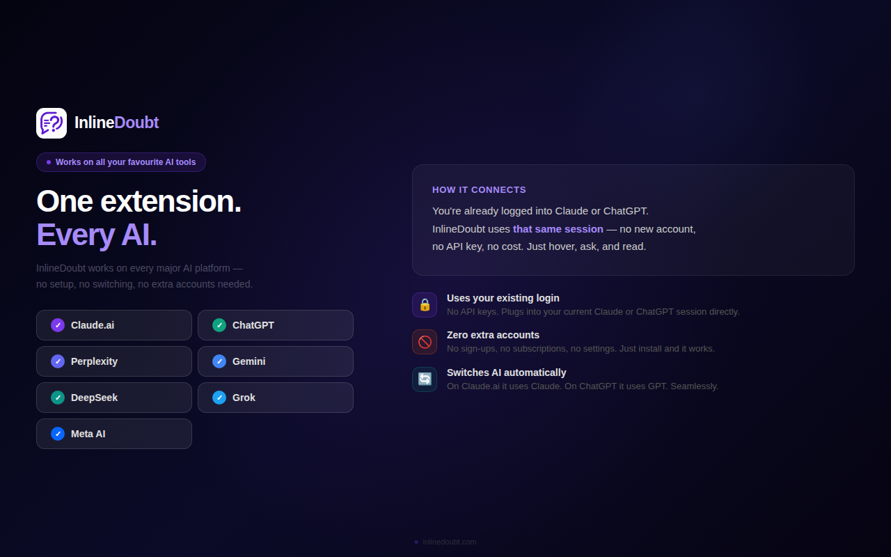

<div align="center">


# InlineDoubt

### Ask doubts inline on any AI answer — no scrolling, no new tabs.

[](https://chrome.google.com/webstore)
[](LICENSE)
[](#works-on)

</div>

---

## What is InlineDoubt?

When you read a long AI answer and have a doubt about a specific line — you normally have to scroll back, lose your place, and ask again in a new message.

**InlineDoubt fixes that.**

Hover any line → a bubble appears → click it → type your doubt → AI explains that exact line **right there**, inline — like a Figma comment anchored to that sentence.

---

## Screenshots



<br/>



<br/>



<br/>



---

## How It Works

1. **Hover** any line in an AI answer — a purple bubble appears
2. **Click** the bubble — a small popup shows with the selected text
3. **Type** your doubt in plain English
4. **AI explains** that exact line right there — no new tab, no scrolling

---

## Features

| Feature | Description |
|---|---|
| 💬 **Inline comment threads** | Figma-style bubbles anchored to each line |
| 🔁 **Follow-up questions** | Ask multiple questions in the same thread |
| ✅ **Mark as Resolved** | Track what you've understood |
| ✏️ **Add personal notes** | Edit or annotate any AI answer |
| 📌 **Pinned to exact line** | Each bubble stays anchored where you asked |
| 💾 **Saved per conversation** | Doubts persist — come back anytime |
| 🗑️ **Remove anytime** | Delete individual doubts or clear all |
| 📋 **Right sidebar panel** | All saved doubts in one place, clickable |

---

## Works On

| Platform | Session-based | API Key |
|---|---|---|
| ✅ Claude.ai | ✓ No key needed | — |
| ✅ ChatGPT | — | Free key (30 sec setup) |
| ✅ Perplexity | ✓ No key needed | — |
| ✅ Gemini | — | Free key (30 sec setup) |
| ✅ DeepSeek | — | Free key (30 sec setup) |
| ✅ Grok | — | Free key (30 sec setup) |
| ✅ Meta AI | — | Free key (30 sec setup) |

> **Claude.ai and Perplexity** use your existing login session — no API key, never limited.
> **All other platforms** use a free API key (no card, no subscription, never expires).

---

## Install

### From Chrome Web Store *(Recommended)*
👉 [Add to Chrome — Free](https://chrome.google.com/webstore)

### Manual Install (Developer Mode)
```
1. Download or clone this repository
2. Open Chrome → go to chrome://extensions
3. Turn ON Developer mode (top right toggle)
4. Click "Load unpacked"
5. Select the inlinedoubt-extension folder
6. Done — go to Claude.ai and try it!
```

---

## Tech Stack

| Layer | Technology |
|---|---|
| Extension Shell | Chrome Manifest V3 |
| UI Injection | Content Script (JS + CSS) |
| Session Auth | `chrome.cookies` API |
| API Calls | Background Service Worker |
| Storage | `chrome.storage.local` |
| DOM Watching | MutationObserver |
| Positioning | CSS `position: absolute` |

---

## How the Session Mechanism Works

```
User is on claude.ai → already logged in → session cookie in browser
        ↓
User hovers a line → clicks bubble → types doubt
        ↓
Extension background.js reads session cookie via chrome.cookies API
        ↓
Calls claude.ai internal API with that cookie
        ↓
Claude replies → shown inline next to the exact line
```

No wrapper around Claude or ChatGPT. No proxy server. No middleman.
The extension uses the **same session** you already have open.

---

## Privacy

- ✅ No data sent to any third-party server
- ✅ No tracking, no analytics
- ✅ Doubts stored locally in your browser only (`chrome.storage.local`)
- ✅ Session cookies only used to call the AI platform you're already on
- ✅ Extension only activates on supported AI platforms

---

## Roadmap

- [ ] PDF support inside browser
- [ ] Export all doubts as notes (Markdown / Notion)
- [ ] Keyboard shortcut to trigger bubble
- [ ] Dark/light theme toggle for sidebar
- [ ] Firefox support

---

## Report a Bug / Request a Feature

👉 [Open an Issue](../../issues)

Found a bug or have an idea? Open an issue — all feedback welcome.

---

## Built By

**Sathish Kumar** — built as a portfolio project to solve a real problem.

If you use InlineDoubt and find it helpful, consider:
- ⭐ Starring this repo
- 🔗 Sharing the Chrome Web Store link
- 🐛 Reporting any bugs you find

---

<div align="center">

Built it , because scrolling back to re-read is the worst.

**[Add to Chrome — Free](https://chrome.google.com/webstore)**

</div>
